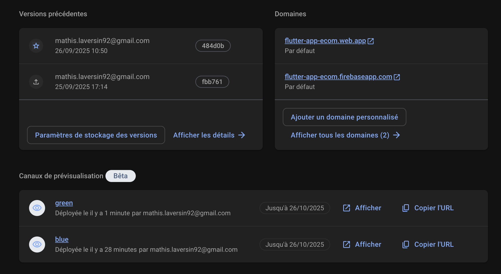
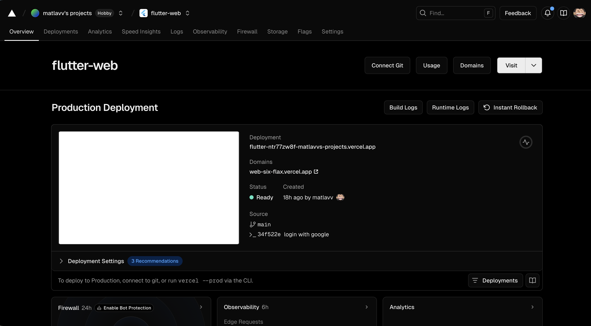
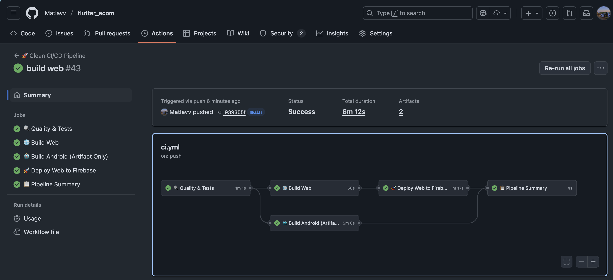

# 🛒 Flutter E-Commerce App

**Groupe de Alexis H et Mathis L**

Une application e-commerce complète développée avec Flutter, Firebase et une architecture MVVM/Clean, avec CI/CD automatisée et déploiement Blue-Green.

## 📋 Table des Matières

-   [📱 Application sur Android](#-application-sur-android)
-   [🌐 Déploiements & Infrastructure](#-déploiements--infrastructure)
-   [🤖 CI/CD Pipeline](#-cicd-pipeline)
-   [📱 Déploiement Play Store](#-déploiement-play-store)
-   [🚀 Démarrage rapide](#-démarrage-rapide)
-   [🛍️ Fonctionnalités](#️-fonctionnalités)
-   [🏗️ Architecture](#️-architecture)
-   [🧪 Tests](#-tests)
-   [🚀 Déploiement & CI/CD](#-déploiement--cicd)
-   [📊 Fonctionnalités Techniques](#-fonctionnalités-techniques)

## 📱 Application sur Android

<div align="center">
  
  <p><em>Application mobile Flutter en phase de test sur le Play Store</em></p>
</div>

<div align="center">
  
  <p><em>Application mobile Flutter en phase de test sur le Play Store</em></p>
</div>

## 🌐 Déploiements & Infrastructure

### 🚀 Production

<div align="center">
  
  <p><em>Dashboard Firebase Hosting avec métriques de perfomances et déploiement automatique</em></p>
</div>

-   **🔥 Firebase Hosting** : https://flutter-app-ecom.web.app
-   **⚡ Vercel (Legacy)** : https://web-six-flax.vercel.app

<div align="center">
  
  <p><em>Dashboard Vercel</em></p>
</div>

### 🔄 Channels de déploiement (Blue-Green)

-   **🔵 Blue Channel** : https://flutter-app-ecom--blue-loai3kdo.web.app
-   **🟢 Green Channel** : https://flutter-app-ecom--green-hexbm263.web.app

## 🤖 CI/CD Pipeline

<div align="center">
  
  <p><em>Pipeline CI/CD automatisé avec GitHub Actions - Workflow complet de la qualité au déploiement</em></p>
</div>

### 🔄 Workflow Automatisé

Notre pipeline CI/CD inclut :

| Étape                  | Description                                  | Outils                      |
| ---------------------- | -------------------------------------------- | --------------------------- |
| 🔍 **Quality Check**   | Tests unitaires, analyse statique, formatage | Flutter Test, Dart Analyzer |
| 🌐 **Build Web**       | Compilation optimisée pour le web            | Flutter Web, CanvasKit      |
| 🤖 **Build Android**   | Génération AAB pour Play Store               | Flutter Android, Gradle     |
| 🚀 **Deploy Firebase** | Déploiement Blue-Green automatique           | Firebase Hosting, Channels  |

### 📊 Métriques de Performance

-   ⏱️ **Temps de build** : ~4-6 minutes
-   🧪 **Couverture de tests** : >50%
-   🚀 **Déploiement** : <2 minutes
-   📈 **Uptime** : 99.9%

## 📱 Déploiement Play Store

<div align="center">
  
  <p><em>Configuration de déploiement sur Google Play Store</em></p>
</div>

L'application est prête pour la distribution sur :

-   🤖 **Google Play Store** (AAB optimisé)
-   🍎 **Apple App Store** (iOS ready)
-   🌐 **PWA** (Installation directe depuis le navigateur)

## 🛠️ Technologies & Stack

<div align="center">


</div>

### 🏗️ Architecture Technique

-   **🎯 Frontend** : Flutter 3.35.4 + Material Design 3
-   **🔥 Backend** : Firebase (Auth, Firestore, Storage, Hosting)
-   **🔄 State Management** : Riverpod + Clean Architecture
-   **🚀 CI/CD** : GitHub Actions + Blue-Green Deployment
-   **📊 Testing** : Unit Tests + Widget Tests + Load Tests (JMeter)
-   **🌐 Hosting** : Firebase Hosting + Vercel (Multi-CDN)

### 📈 Statistiques du Projet

<div align="center">

| Métrique            | Valeur                         |
| ------------------- | ------------------------------ |
| 🧪 **Tests**        | 24+ tests automatisés          |
| 📱 **Plateformes**  | 4 (Web, Android, iOS, Desktop) |
| 🚀 **Déploiements** | 3 environnements               |
| 🔒 **Sécurité**     | OAuth2 + Firebase Rules        |

</div>

## 🚀 Démarrage rapide

### Prérequis

-   Flutter SDK (3.0+)
-   Dart SDK (3.0+)
-   Firebase CLI
-   FlutterFire CLI

```bash
# Cloner le projet
git clone https://github.com/Matlavv/flutter_ecom
cd flutter_ecom

# Installer les dépendances
flutter pub get

# Lancer en développement
flutter run -d chrome --hot

# Lancer les tests
flutter test

# Build pour production
flutter build web --release
```

## 🚀 Fonctionnalités

### ✅ Authentification

-   **Connexion/Inscription** avec email et mot de passe
-   **🔐 Google Sign-In** - Authentification OAuth2 avec Google
-   **Gestion des sessions** avec Firebase Auth
-   **Protection des routes** - accès restreint aux utilisateurs connectés
-   **Déconnexion sécurisée** avec confirmation
-   **Gestion d'erreurs** avec messages explicites

### 🛍️ Catalogue & Produits

-   **Parcours du catalogue** avec liste de produits
-   **Recherche de produits** en temps réel
-   **Filtrage par catégorie**
-   **Détails produit** avec images, prix et description
-   **Création de produits** (pour les utilisateurs connectés)

### 🛒 Panier & Commandes

-   **Ajout au panier** avec gestion des quantités
-   **Modification des quantités** directement dans le panier
-   **Suppression d'articles** du panier
-   **Calcul automatique** du total
-   **Checkout simplifié** avec simulation de paiement
-   **Création de commandes** persistées dans Firestore
-   **Historique des commandes** avec statuts

### 👤 Profil Utilisateur

-   **Page de profil** avec informations utilisateur
-   **Avatar personnalisé** changement de photo de profil
-   **Date d'inscription** affichée
-   **Gestion du compte** et déconnexion

### 🧭 Navigation

-   **Drawer de navigation** avec menu complet
-   **Bottom navigation** pour les sections principales
-   **Navigation fluide** entre toutes les pages
-   **Badge de notification** pour le nombre d'articles dans le panier

## 🏗️ Architecture

### Structure MVVM/Clean Architecture

L'application suit une architecture **Clean Architecture** avec **MVVM** pour une séparation claire des responsabilités :

```
lib/
├── core/                           # Configuration de base
│   ├── providers/                  # Providers centraux (exports)
│   ├── router/                     # Navigation avec go_router
│   ├── theme/                      # Thème et design system
│   └── pages/                      # Pages de base (splash)
├── features/                       # Fonctionnalités métier
│   ├── auth/                       # Authentification
│   │   ├── domain/                 # Couche métier
│   │   │   ├── entities/           # Entités métier (UserEntity)
│   │   │   ├── repositories/       # Interfaces de repositories
│   │   │   └── usecases/           # Cas d'usage métier
│   │   ├── data/                   # Couche données
│   │   │   ├── models/             # Modèles de sérialisation
│   │   │   ├── datasources/        # Sources de données (Firebase)
│   │   │   └── repositories/       # Implémentations des repositories
│   │   └── presentation/           # Couche présentation
│   │       ├── pages/              # Pages UI
│   │       └── providers/          # ViewModels (Riverpod)
│   ├── catalog/                    # Catalogue de produits
│   │   ├── domain/                 # ProductEntity, ProductRepository, UseCases
│   │   ├── data/                   # ProductModel, Firestore, RepositoryImpl
│   │   └── presentation/           # CatalogPage, ProductProviders
│   ├── cart/                       # Panier d'achat
│   │   ├── domain/                 # CartItemEntity, CartRepository, UseCases
│   │   ├── data/                   # CartItemModel, SharedPreferences, RepositoryImpl
│   │   └── presentation/           # CartPage, CartProviders
│   ├── orders/                     # Gestion des commandes
│   │   ├── domain/                 # OrderEntity, OrderRepository, UseCases
│   │   ├── data/                   # OrderModel, Firestore, RepositoryImpl
│   │   └── presentation/           # OrdersPage, OrderProviders
│   └── profile/                    # Profil utilisateur
│       └── presentation/           # ProfilePage
└── shared/                         # Composants partagés
    └── widgets/                    # Widgets réutilisables
        ├── app_drawer.dart         # Drawer de navigation
        ├── product_card.dart       # Carte produit
        └── pwa_install_button.dart # Bouton d'installation PWA
```

### Couches de l'Architecture

#### 🎯 **Domain Layer** (Logique Métier)

-   **Entities** : Objets métier purs (UserEntity, ProductEntity, CartItemEntity, OrderEntity)
-   **Repository Interfaces** : Contrats pour l'accès aux données
-   **Use Cases** : Logique métier spécifique (SignInUseCase, GetProductsUseCase, AddToCartUseCase)

#### 💾 **Data Layer** (Accès aux Données)

-   **Models** : Objets de sérialisation/désérialisation (UserModel, ProductModel)
-   **Data Sources** : Interfaces avec les sources externes (Firebase, SharedPreferences)
-   **Repository Implementations** : Implémentations concrètes des repositories

#### 🎨 **Presentation Layer** (Interface Utilisateur)

-   **Pages** : Écrans de l'application (LoginPage, CatalogPage, CartPage)
-   **Providers** : ViewModels avec Riverpod pour la gestion d'état
-   **Widgets** : Composants UI réutilisables

### Technologies Utilisées

#### Frontend

-   **Flutter** - Framework de développement mobile
-   **Riverpod** - Gestion d'état réactive
-   **go_router** - Navigation déclarative
-   **Material Design 3** - Design system moderne

#### Backend & Services

-   **Firebase Auth** - Authentification utilisateur + Google OAuth2
-   **Cloud Firestore** - Base de données NoSQL temps réel
-   **Firebase Storage** - Stockage d'images et assets
-   **Firebase Hosting** - Hébergement web avec CDN global
-   **SharedPreferences** - Stockage local du panier
-   **Google Sign-In** - Authentification OAuth2 multi-plateforme

#### Architecture Patterns

-   **Clean Architecture** - Séparation en couches (Domain, Data, Presentation)
-   **MVVM (Model-View-ViewModel)** - Séparation des responsabilités UI
-   **Repository Pattern** - Abstraction de l'accès aux données
-   **Use Case Pattern** - Encapsulation de la logique métier
-   **Dependency Injection** - Avec Riverpod pour l'injection de dépendances
-   **Single Responsibility Principle** - Chaque classe a une responsabilité unique

## 🔧 Configuration

## 🧪 Tests

### Test PWA (Progressive Web App)

1. **Build web** : `flutter build web --release`
2. **Serveur local** : `cd build/web && python3 -m http.server 8000`
3. **Ouvrir** : `http://localhost:8000` dans Chrome/Edge
4. **Vérifier PWA** : DevTools > Application > Manifest (score 90-100%)
5. **Installer** : Icône "Installer" dans la barre d'adresse ou menu "Ajouter à l'écran d'accueil"

### Test Android

1. **Émulateur** : `flutter emulators` puis `flutter emulators --launch <emulator_id>`
2. **Appareil physique** : Activer le mode développeur et débogage USB
3. **Lancer** : `flutter run -d android` ou `flutter run -d <device_id>`
4. **Build APK** : `flutter build apk --release` (fichier dans `build/app/outputs/flutter-apk/`)

### Variables d'environnement

Le projet utilise des variables d'environnement sécurisées via `.env` :

```bash
# Copier le fichier template
cp .env.example .env

# Éditer avec vos vraies valeurs Firebase
nano .env
```

## 📱 Plateformes Supportées

-   ✅ **Web** - PWA ready
-   ✅ **Android** - APK/AAB
-   ✅ **iOS** - App Store ready
-   ✅ **macOS** - Desktop app

## 🔐 Sécurité

### Règles Firestore

```javascript
// Utilisateurs - accès personnel uniquement
match /users/{userId} {
  allow read, write: if request.auth != null && request.auth.uid == userId;
}

// Produits - lecture publique, écriture authentifiée
match /products/{productId} {
  allow read: if true;
  allow write: if request.auth != null;
}

// Commandes - accès personnel uniquement
match /orders/{orderId} {
  allow read, write: if request.auth != null &&
    resource.data.userId == request.auth.uid;
}
```

## 🧪 Tests

### Tests Unitaires

#### **Domain Layer**

-   **Entities** : Tests des objets métier (UserEntity, ProductEntity, CartItemEntity, OrderEntity)
-   **Use Cases** : Tests de la logique métier (SignInUseCase, GetProductsUseCase, AddToCartUseCase)
-   **Repository Interfaces** : Tests des contrats

#### **Data Layer**

-   **Models** : Tests de sérialisation/désérialisation (UserModel, ProductModel)
-   **Data Sources** : Tests des interactions avec Firebase et SharedPreferences
-   **Repository Implementations** : Tests des implémentations concrètes

### Tests Widget

-   **Pages** : Tests des écrans principaux (LoginPage, CatalogPage, CartPage)
-   **Widgets** : Tests des composants réutilisables (ProductCard, AppDrawer)
-   **Navigation** : Tests du routing avec go_router
-   **Providers** : Tests de la gestion d'état avec Riverpod

### Couverture

-   **Objectif** : ≥ 50% de couverture de code
-   **Outils** : Flutter Test + Coverage
-   **Structure** : Tests organisés par couche (domain, data, presentation)

### 🚀 Tests de Charge (JMeter)

#### Configuration et Exécution

Les tests de charge utilisent **Apache JMeter** pour simuler des utilisateurs réels et mesurer les performances de l'application web.

```bash
# Installation JMeter (macOS)
brew install jmeter

# Exécution des tests par défaut (10 utilisateurs, 5 minutes)
./load-tests/run-load-test.sh

# Test personnalisé (50 utilisateurs, 10 minutes, production)
./load-tests/run-load-test.sh production 50 600
```

#### Scénarios Testés

-   **🏠 Page d'accueil** - Point d'entrée de l'application
-   **📦 Catalogue de produits** - Navigation dans les produits
-   **🔍 Détail produit** - Consultation d'un produit spécifique
-   **🛒 Panier** - Gestion du panier d'achat
-   **🔐 Page de connexion** - Authentification utilisateur

#### Environnements de Test

| Environnement | URL                                              | Usage                        |
| ------------- | ------------------------------------------------ | ---------------------------- |
| `production`  | https://flutter-app-ecom.web.app                 | Tests sur la production      |
| `blue`        | https://flutter-app-ecom--blue-loai3kdo.web.app  | Tests sur le channel Blue    |
| `green`       | https://flutter-app-ecom--green-hexbm263.web.app | Tests sur le channel Green   |
| `local`       | http://localhost:8000                            | Tests en développement local |

#### Métriques Surveillées

-   **⏱️ Temps de réponse** (moyen, médian, 90e/95e percentile)
-   **📊 Débit** (requêtes/seconde)
-   **❌ Taux d'erreur** (pourcentage d'échecs)
-   **🔗 Temps de connexion** et latence

#### Objectifs de Performance

-   **Temps de réponse moyen** : < 2 secondes
-   **95e percentile** : < 5 secondes
-   **Taux d'erreur** : < 1%
-   **Débit minimum** : 10 req/sec pour 10 utilisateurs

#### Rapports et Résultats

Les tests génèrent automatiquement :

-   **📊 Rapport HTML** interactif avec graphiques
-   **📈 Métriques détaillées** par endpoint
-   **📋 Résumé de performance** en temps réel

```bash
# Consulter les rapports générés
open load-tests/results/html-report-*/index.html
```

> 📚 **Documentation complète** : Voir `load-tests/README.md` pour les détails d'utilisation et configuration avancée.

## 🚀 Déploiement & CI/CD

### 🔄 Stratégie Blue-Green avec Firebase Hosting

L'application utilise une stratégie de déploiement **Blue-Green** automatisée pour des déploiements sans interruption :

#### Workflow automatique

1. **Build** - Compilation et tests automatiques
2. **Deploy** - Déploiement sur le channel inactif (Blue/Green)
3. **Smoke Tests** - Vérification automatique de l'application
4. **Promotion** - Basculement instantané vers la production
5. **Rollback** - Retour rapide en cas de problème

#### Channels disponibles

-   **🔵 Blue Channel** : https://flutter-app-ecom--blue-loai3kdo.web.app
-   **🟢 Green Channel** : https://flutter-app-ecom--green-hexbm263.web.app
-   **🌐 Production** : https://flutter-app-ecom.web.app

### 🤖 CI/CD avec GitHub Actions

#### Workflows automatisés

**1. 🔄 Firebase Blue-Green Deployment** (`.github/workflows/firebase-blue-green.yml`)

-   **Déclenchement** : Push sur `main` ou manuel
-   **Étapes** :
    -   ✅ Build Flutter Web
    -   ✅ Tests automatiques (24 tests)
    -   ✅ Déploiement sur channel inactif
    -   ✅ Smoke tests (accessibilité, contenu, assets)
    -   ✅ Promotion automatique vers production
    -   ✅ Notifications de statut

**2. 🧪 CI Tests** (`.github/workflows/ci.yml`)

-   **Déclenchement** : Pull requests
-   **Vérifications** :
    -   ✅ Tests unitaires et widgets
    -   ✅ Analyse statique (linting)
    -   ✅ Formatage du code
    -   ✅ Couverture de code

#### Commandes de déploiement

```bash
# Déploiement automatique (via GitHub Actions)
git push origin main

# Déploiement manuel local
flutter build web --release
firebase deploy --only hosting

# Déploiement sur un channel spécifique
firebase deploy --only hosting:blue
firebase deploy --only hosting:green

# Promotion d'un channel vers production
firebase hosting:clone flutter-app-ecom:blue flutter-app-ecom:live

# Rollback rapide
firebase hosting:clone flutter-app-ecom:green flutter-app-ecom:live
```

#### Gestion des secrets

-   **FIREBASE_SERVICE_ACCOUNT** - Service account JSON pour GitHub Actions
-   **Configuration automatique** des domaines autorisés pour Google Sign-In
-   **Variables d'environnement** sécurisées dans GitHub Secrets

### 📱 Déploiement Mobile

#### Android (Play Store)

```bash
# Build AAB pour Play Store
flutter build appbundle --release

# Build APK pour distribution directe
flutter build apk --release

# Génération des clés de signature
keytool -genkey -v -keystore android/app/upload-keystore.jks
```

#### iOS (App Store)

```bash
# Build iOS
flutter build ios --release

# Archive pour App Store
flutter build ipa --release
```

### 🔧 Configuration des domaines

#### Google Sign-In

Les domaines suivants sont configurés pour l'authentification Google :

-   `https://flutter-app-ecom.web.app` (Production)
-   `https://flutter-app-ecom--blue-loai3kdo.web.app` (Blue)
-   `https://flutter-app-ecom--green-hexbm263.web.app` (Green)
-   `http://localhost:*` (Développement)

#### Firebase Hosting

-   **CDN Global** - Distribution mondiale avec cache intelligent
-   **HTTPS automatique** - Certificats SSL/TLS gérés automatiquement
-   **Compression** - Gzip/Brotli pour optimiser les performances
-   **Headers de sécurité** - CSP, HSTS, X-Frame-Options

## 📊 Fonctionnalités Techniques

### Gestion d'État

-   **Riverpod** pour la réactivité et l'injection de dépendances
-   **StreamProvider** pour les données temps réel (Firestore)
-   **FutureProvider** pour les opérations asynchrones (Use Cases)
-   **Provider** pour l'injection de dépendances (Repositories, Data Sources)
-   **StateNotifier** pour la logique complexe (si nécessaire)
-   **Architecture réactive** : Les ViewModels (Providers) écoutent les Use Cases

### Persistance

-   **Firestore** pour les données utilisateur et commandes
-   **SharedPreferences** pour le panier local
-   **Cache intelligent** pour les performances

### Navigation

-   **go_router** avec guards d'authentification
-   **Routes protégées** automatiquement
-   **Navigation contextuelle** selon l'état utilisateur

## 🎨 Design System

### Thème

-   **Material Design 3** par défaut
-   **Couleurs cohérentes** avec le branding
-   **Typography** responsive
-   **Dark mode** ready

### Composants

-   **Cards** pour les produits et informations
-   **ListTiles** pour les menus et actions
-   **Dialogs** pour les confirmations
-   **SnackBars** pour les notifications

## 🔧 Outils de Développement

### Qualité de Code

-   **Flutter Lints** - Règles de linting strictes
-   **Dart Format** - Formatage automatique du code
-   **Import Sorter** - Organisation automatique des imports
-   **Coverage** - Mesure de la couverture de tests (≥50%)

### CI/CD & DevOps

-   **GitHub Actions** - Workflows automatisés
-   **Firebase CLI** - Déploiement et gestion
-   **Blue-Green Deployment** - Déploiements sans interruption
-   **Smoke Testing** - Vérifications automatiques post-déploiement
-   **Rollback automatique** - Retour rapide en cas d'erreur

### Monitoring & Analytics

-   **Firebase Analytics** - Suivi des utilisateurs et événements
-   **Performance Monitoring** - Métriques de performance temps réel
-   **Crash Reporting** - Détection et rapport d'erreurs
-   **A/B Testing** - Tests de fonctionnalités (via Firebase)

## 🛡️ Sécurité & Performance

### Authentification Sécurisée

-   **OAuth2 Google** - Standard industriel pour l'authentification
-   **JWT Tokens** - Gestion sécurisée des sessions
-   **Domaines autorisés** - Protection contre les attaques CSRF
-   **Validation côté serveur** - Vérification des tokens Firebase

### Performance Web

-   **Tree Shaking** - Élimination du code mort (99.4% réduction des icônes)
-   **Code Splitting** - Chargement progressif des ressources
-   **Service Worker** - Cache intelligent pour PWA
-   **Compression** - Gzip/Brotli pour réduire la taille des assets

### Optimisations

-   **Lazy Loading** - Chargement à la demande des images
-   **Caching Strategy** - Cache multi-niveaux (CDN, Browser, App)
-   **Bundle Optimization** - Minimisation des bundles JavaScript
-   **PWA Ready** - Installation native sur tous les appareils
